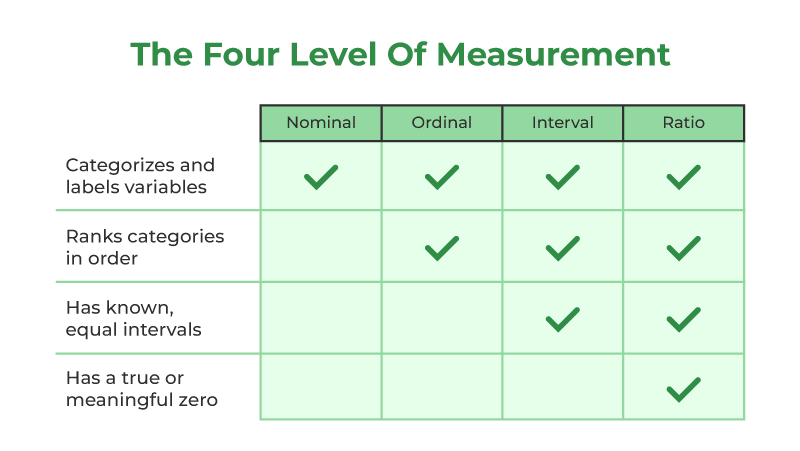

# Statistics - Foundation of Data Science

## Basic Terminology

1. **Data** - Facts, numbers, or observations collected for analysis. Data is the raw material used to uncover patterns and insights.

2. **Variable** - Building blocks of analysis. They help us define what we are measuring and how wwe'll analyse it.
   1. **Quantitive Variables** - Numerical data that can be measured *(age, income and temperature)*.
   2. **Qualitative Variables** - Categorical data that describes qualities. *(gender, color, product type)*.

3. **Population** - Compelete set of individuals, objects or data points of interest in a study.

4. **Sample** - Subset of population selected for analysis. Used when studying entire population is impossible or unnecessary *(height of 1000 adults to estimate height of every adult in country.)*.

5. **Paramater** - Numerical value that describes a characteristic of a population. They are often unknown and estimated with sample data. *(average income of all households in a city is a parameter)*

6. **Statistic** - Numerical value that describes character of sample. They are used to estimate parameters and make inferences. *(avereage income of 100 households in a city)*

# Type of Statistics

## Descriptive Statistics
   - They summarise and descibe the main feature of a dataset.
   - They are essential for organising and simplyfying the data. 
   - They provide simple summary about sample and help us understand key features : 
     - **Measures of central tendency** - Mean, Median, Mode.
     - **Measures of variablity** - Range, Variance, and Standard Deviation.
     - **Measures of Frequency Distribution** - Histograms, Frequency tables.

# Inferential Statistics
   - They allow us to make predictions or inferences about a population based on sample data.
   - They help us generalise findings from a sample to a larger population.

# Types of Data

## Quantitative Data
- Consists of numerical values that can be measured.
- It can be subdivided into : 
  1. **Discrete** - Countable values that cannot be divided into smaller parts. *(Number of stdents in a class, no of parking lot)*
  2. **Continous Data** - Measurable values that can be take any value within a range. *(height, weight, temerature)*.

## Qualitative Data
- It describes qualities or characteristics and is non numerical. 
- It is divided into : 
  1. **Nominal Data** - Categories without an inherent order. *(Gender, Color, fruits)*
  2. **Ordinal Data** - Categrories with a meaningful or ranking *(Education levels, Customer satisafaction ratings)*

# Leval of Measurement

Level of measurement determines how data can be analyzed and what techniques are best suited.

## 1. Nominal Data 
- It is the simplest level of measurement.
- It categorises data into distinct groups or labels without any order or ranking.
  - Types of fruits
  - Colors
It is analysed using:
     - **Frequency Counts** *(How many appple vs banana)*
     - **Mode** *(The most frequently occuring category)*

## 2. Ordinal Level
- It builds on nominal data by introducing ranking or order.
- While categories can be ranked,the diffenrences are not measurable or meaningful. 
  - Education levels *(High School, bachelors, masters)*
  - Customer satisfaction ratings *(poor,fair, good, excellent)*
It can be summarised using : 
  - **Median** *(Middle Value)*
  - **Mode** *(Most frequently occuring value)*

`Mean can't be used because the intervals between rankings are not consistent`

## 3. Interval Level
 - It is numerical and the differences between values are meaningful.
 - It lacks **TRUE ZERO POINT** meaning hvaing zero doesn't indicate the absence of character being measured.
   - Differnce between 30°C and 40°C is the same as in between 20°C and 30°C
   - IQ Scores
- `Zero doesn't mean "none"` for instance the 0°C doesn't mean the absence of temperature, it's just a scale point.
- Interval data allows addition and subtraction but not multiplication or division.

## 4. Ratio Level
- It is the most advanced level of measurement.
- It's ability to allow all mathematical opeartions make  it most verstaile measurement.
- It has all properties of interval data and a true zero point.
- `Here zero indicates complete ABSENCE` of the characteristic being measured for instance 0kg means no weight and 0 income means no earnings.
  - Height, Weight, Income.
  - Number of children in a family.

# Example of how Statistics is used

**Predicting Customer Churn**
- Suppose a telecom company wants to find out why some customers are leaving and how to reduce it. Here’s a small sample of the dataset:

| CustomerID	| MonthlyCharges	| Tenure	| Contract	| Churn| 
| ----- | ----- | -- | ------------ | --- |
| 1001	| 70	| 2	| Month-to-Month	| Yes| 
| 1002	| 35	| 30	| One year	| No| 
| 1003	| 55	| 10	| Month-to-Month	| Yes| 
| 1004	| 40	| 12	| Month-to-Month	| No| 
| 1005	| 80	| 1	| Month-to-Month	| Yes| 

### Now, Let's Apply Statistics
1. **Churn Rate**
- Total customers = 5
- Churned = 3
- Churn Rate = (3 / 5) × 100 = 60%
2. **Average Tenure of Churned Customers**
- Tenure = 2, 10, 1
- Average = (2 + 10 + 1) / 3 = 4.33 months
3. **Average Monthly Charges**
- Churned: (70 + 55 + 80)/3 = 68.33
- Not Churned: (35 + 40)/2 = 37.5
4. **Churn by Contract Type**

| Contract	| Churned	| Total	| Churn Rate| 
| ----------- | ------ | ------- | ------ |
| Month-to-Month	| 3	| 4	| 75%| 
| One year	| 0	| 1	| 0%| 

#### What Can We Infer from These Stats?
- Customers with Month-to-Month contracts are more likely to leave — 75% churn rate.
- People who leave usually do so within the first few months (average tenure is 4.33).
- Churned users have higher monthly charges than others.

## Tools in Data Analysis

Multiple tools are used in multiple cases it is important to understand what type of data we are using and what extract we want from it. 

| Tool/Concept	| Use in Data Analysis| 
| -------------- | ------------------- |
| Mean, Median, Mode	| Measure central tendency of data| 
| Standard Deviation	| Measure spread/variability| 
| Percentages and Ratios	| Compare parts of a whole| 
| Correlation	| Check relationships between two variables| 
| Regression	| Predict values and understand influence| 
| Hypothesis Testing	| Validate assumptions about data| 
| Frequency Tables & Charts	| Visualize distributions and categories| 