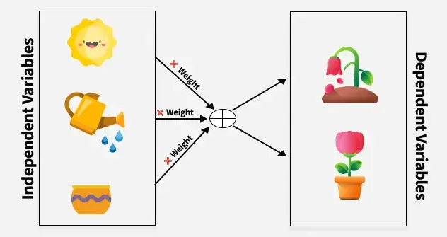
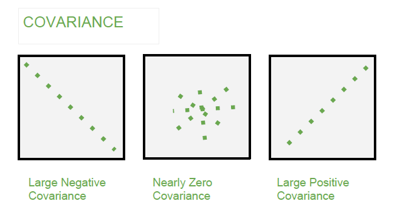
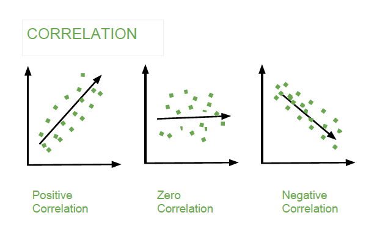

# Covariance and Correlation

- They are the concepts that helps us understand relationship between two variables.
- Independent Variables such as Sunlight, Water, Soil nutrients affect plant growth (our dependent variable).
- Covariance measures how these variables change together.

# Covariance 
- It measures relationship between a pair of random variables where one variable causes a change in another variable.
- Calculated by taking average of product of deviations of each variable from their respective means.
- It helps us understand `direction of relationship but not strength`.
  - It takes any value between $-\infty$ to $+\infty$ where sign of value depends relationship direction.
  - It is used to linear relationship between variables.
  - It gives direction of the relationship

## Sample Covariance

$$
Cov_s(X,Y) = \frac{1}{n-1} \sum^n_\text{i=1} (X_i - \bar{X}) (Y_i - \bar{Y})
$$

Where
- $X_i$ :  The $i^\text{th}$ value of the variable X in the sample.
- $Y_i$ : The $i^\text{th}$ value of the variable Y in the sample.
- $\bar{X}$ : The sample mean of variable X (i.e all the average of $X_i$ values in sample).
- $\bar{Y}$ : The sample mean of variable Y (i.e all the average of $Y_i$ values in sample)
- $n$ : The number of data points in the sample.
- $\sum$ : The Summation of the product of the deviations for the data point.
- $n-1$ : The is degree of freedom. It is used to correct the bias of population `also called Bessel's correction`. 

## Population Covariance

$$
Cov_p(X,Y) = \frac{1}{n-1} \sum^n_\text{i=1} (X_i - \mu_X) (Y_i - \mu_Y)
$$

Where
- $X_i$ :  The $i^\text{th}$ value of the variable X in the sample.
- $Y_i$ : The $i^\text{th}$ value of the variable Y in the sample.
- $\mu_X$ : The population mean of variable X (i.e all the average of $X_i$ values in population).
- $\mu_Y$ : The population mean of variable Y (i.e all the average of $Y_i$ values in population)
- $n$ : The number of data points in the population.
- $\sum$ : The Summation of the product of the deviations for the data point.
- $n$ : The is degree of freedom. As we use entire population data `so no need for Bessel's correction`. 

## Types of Covariance
- **Positive Covariance** - as one variable increases the other one increases as well.
- **Negative Covariance** - as one variable increases, the other one decreses.
- **Zero Covariance** - There is no linear realationship between 2 variables.

# Correlation
- `Standardise measure of strength and direction` of linear relationship between 2 variables.
- It is derived from covariance and ranges between -1 and 1.
- Measure: 
  - **Positive Correlation (Close to +1)** - as one variable increase so does the other.
  - **Negative Correlation (Close to -1)**  - as one increases other decreases.
  - **Zero Correlation** - there is no linear relationship between the variables.

$$ 
Corr(x,y) = \frac{\sum^n_\text{i=1} (x_i - x') (y_i - y')} {\sqrt{\sum^n_\text{i=1}}(x_i - x')^2 \sum^n_\text{i=1}(y_i - y')^2}
$$

- x' and y' = Mean of given sample set
- n = total number of sample
- $x_i$ and $y_i$ = individual sample of set

# Difference in Covariance and Correlation

| Covariance	| Correlation| 
| ------------- | ---------- |
| Covariance is a measure of how much two random variables vary together	| Correlation is a statistical measure that indicates how strongly two variables are related.| 
| Involves the relationship between two variables or data sets	| Involves the relationship between multiple variables as well| 
| Lie between -infinity and +infinity	| Lie between -1 and +1| 
| Measure of correlation	| Scaled version of covariance| 
| Provides direction of relationship	| Provides direction and strength of relationship| 
| Dependent on scale of variable	| Independent on scale of variable| 
| Have dimensions	| Dimensionless| 

## Applications in real life

| Covariance | Correlation | 
| ---------- | ----------- | 
| Porfolio management in finance *(To see how stocks are working together)* | Market Research *(To see how consumer behaviour and sales trends)* |
| Genetics Reviews *(To see how 2 genes traits are affecting each other)* | Medical research *(To see relationship between different health indicators such as BP and Cholestrol levels)* |