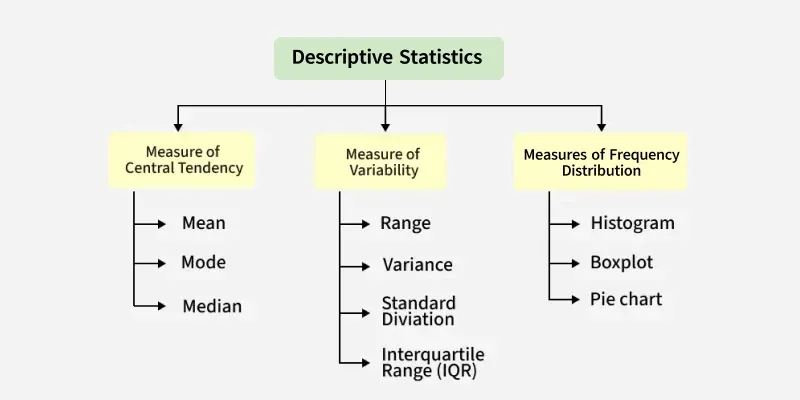
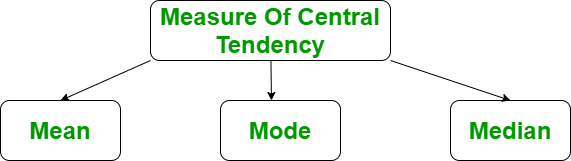

# Descriptive Statistics

- Descriptive Stats are simple tools that help us understand and summarise data.
- There are 3 categories for it's spread



## Measures of Central Tendency
- They are values that describe the central position within a dataset.


- It is divided into 3 categories - Mean, Median, Mode


### Mean
- It is the sum of observations divided by the total number of observations.
- It is defined as average value.
$$
\mu = \frac{1}{n} \sum_{i=1}^{n} x_i
$$ 

<p align="center">or also simplified as </p>

$$
\bar{x} = \frac {\sum {x}} {n} 
$$

```python
import numpy as np

# Sample Data
arr = [5, 6, 11]

# Mean
mean = np.mean(arr)

print("Mean = ", mean)
```

### Mode 
- The most frequently occuring value in the dataset
- Most useful for categorical data.

```python
import scipy.stats as stats

# sample Data
arr = [1, 2, 2, 3]

# Mode
mode = stats.mode(arr)
print("Mode = ", mode)
```

### Median 
- It is the middle value in a sorted dataset.
- For odd values it's the central one.
- For even values it's te average of central ones.
- Better choice for `skewed data`.

```python
import numpy as np

# sample Data
arr = [1, 2, 3, 4]

# Median
median = np.median(arr)

print("Median = ", median)
```

## Measures of Variablity
- It helps us understand spread or distribution of observations in a database.
- It is also called measures of dispersion.
- It is divided into 3 categories - Range 

### Range
- The difference between the largest and the smallest data point in our dataset.
- This method provides a quick sense of data spread.
- `Range is susceptible to outliers`

$$
Range = \text{Largest value} - \text{Smallest value}
$$

```python
import numpy as np

# Sample Data
arr = [1, 2, 3, 4, 5]

# Finding Max
Maximum = max(arr)
# Finding Min
Minimum = min(arr)

# Difference Of Max and Min
Range = Maximum-Minimum
print("Maximum = {}, Minimum = {} and Range = {}".format(
    Maximum, Minimum, Range))
```

### Variance 
- It is the average squared deviation from the mean.
- It is calculate by finding difference between every data point and the mean value.

$$
\sigma^2 = \frac {\sum(x - \mu)^2} {N}
$$

- x -> Observation under consideration
- N -> number of terms 
- mu -> Mean 

```python
import statistics

# sample data
arr = [1, 2, 3, 4, 5]
# variance
print("Var = ", (statistics.variance(arr)))
```

### Standard Deviation
- It is the most used measure of dispersion in data.
- It is very helpful in assesing model performance.
- It is defined as square root of variance.
  - taking difference of all values from mean
  - squaring them all
  - dividing them by number of values
  - lastly squaring root them.

$$
\sigma = \sqrt { \frac {\sum (x - \mu)^2} {N} }
$$

- x = Observation under consideration
- N = number of terms 
- mu = Mean

```python
import statistics
arr = [1, 2, 3, 4, 5]
print("Std = ", (statistics.stdev(arr)))
```

## Measures of Frequency distributions
- It is made with frequecny distribution table
- It shows how data points are distributed across different categories or intervals.
- It helps identify patterns, outliers and overall structure of dataset.
- First step before applyuing more complex visualisations.
- It includes 
  - Data Intervals
  - Frequency Counts
  - Relative Frequencies
  - Cumulative Frequencies