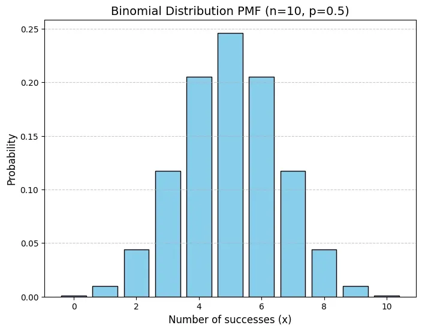
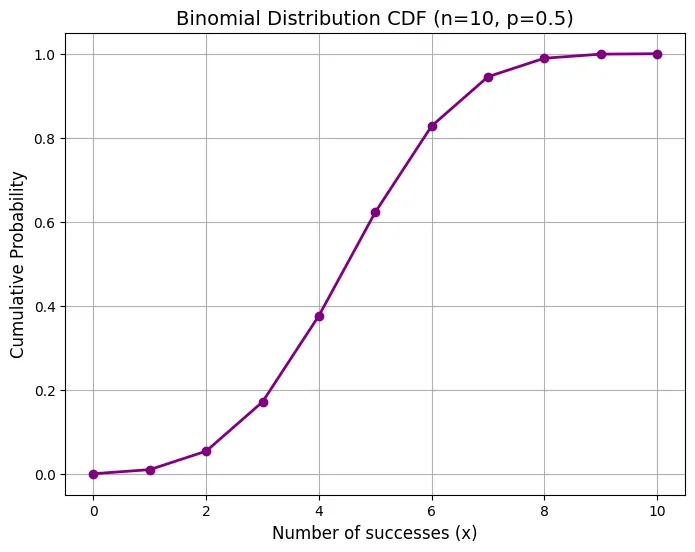

# Binomial Distribution

- It is used to calculate the probability of a specific number of independent trials where each trials results in two outcomes success or faliure.
- It is used in quality control, election prediction, medical tests etc.

## Important terms
1. **Bernoulli Trial** - It is an experiment with independent trials that results in one of two outcomes : Success or Faliure. *(Tossing a coin - Heads or Faliure)* 
2. **Number of trials** - Fixed number of trials performed in the experiment. *(flip a coin 5 times? n = 5)*
3. **Success Probability** - Probability of success in each trials is denoted by p. It is constant in nature for all trials.*(Fair coin with probability of heads, p = 0.5)*
4. **Faliure Probability** - Probability of faliure is denoted by q and is calculated as 1 - p. *(For coin toss p = 0.5 so q = 1 - 0.5)*

## Formula

$$
P (X = x) =  \binom{n}{x} \cdot p^x \cdot (1 - p)^{n-x}
$$

- $P(X = x)$ is the probability of getting exactly x success.
- $n$ is the number of trails
- $x$ is the number of success we want to calculate probability for
- $p$ is the probability of success in each trials
- $(^n_x)$ is the **binomial coefficient** which represents the number of ways to arrange $x$ successes in $n$ trials.

$$
(^n_x) = \frac{n!}{x! (n-x)!}
$$

## Probability Mass Function
- It defines the probability of a specified number of success occuring in the binomial distribution.
- likelihood of getting $x$ successes in $n$ trials.

$$
P (X = x) = \binom {n} {x} \cdot p^x \cdot (1 - p)^{n-x}
$$

### Question
Let’s say we flip a coin 4 times (n= 4) and want to know the probability of getting exactly 2 heads (successes). Since the probability of heads is p= 0.5 for a fair coin, the probability of tails (failure) is q = 1−p = 0.5.

#### Solution
1. We calculate the probability using the PMF formula 
$$
P (X = 2) = \binom{4}{2} \cdot (0.5)^2 \cdot (0.5)^{4-2}
$$

2. Then we calculate binomial coefficient : 

$$
\binom{4}{2} = \frac{4!}{(4 - 2)! \cdot 2!} = \frac{4 \times 3}{2 \times 1} = 6
$$

3. Now we substitute the values into PMF formula

$$
P(X = 2) = 6 \times (0.5)^2 \times (0.5)^2 = 6 \times 0.25 \times 0.25 = 0.375
$$

So the probability of getting exactly 2 heads in 4 tosses is 0.375 or **37.5%**

## Cumulative Distribution Function
- CDF of Binomial distrbution gives us the probability of obtaining at most x successes in n trails. It is the sum of probabilities from $P(X = 0)$ to $P(X = x)$

$$
F(x) = P(X \geq x) = \sum^x_{k = 0} P(X = k)
$$

- It helps in getting probability of getting zero, one, two or more in n trials.

### Example 
If we want to know the probability of getting 3 or fewer heads in 5 coin tosses (n=5) we would calculate 
P(X≤3) by summing the probabilities:

$P(X≤3)=P(X=0)+P(X=1)+P(X=2)+P(X=3)$

## Expected value of Binomial Distribution
- The expected value (mean) of a binomial distribution represents the average number of success we expect after performing n trials. 

$$
\mathbb{E}[X] = n \cdot p
$$

- suppose if we flip a fair coin 5 times then the expected number of heads would be $\mathbb{E}[X] = 5 \times 0.5 = 2.5$
- So we would expect a 2.5 heads on average after 5 flips of coin.

## Variance 
- It measures how much the number of success varies from the expected value.

$$
Var[X] = n \cdot p \cdot (1-p)
$$

## Standard Deviation 
- It is the square root of variance which gives a measure of how much the success is likely to differ from the expected value on average.

$$
\sigma = \sqrt{n \cdot p \cdot (1 - p)}
$$

## Example 

### Question
Let’s apply the Binomial Distribution in a real-life scenario. Consider an airline that sells 65 tickets for a flight with a capacity of 60 passengers. The probability that a passenger does not show up for the flight is q=0.1 means the probability that a passenger shows up is p=0.9. The airline wants to know the probability that 60 or fewer passengers will show up so they don’t need to reschedule tickets.

### Answer
- Step 1: Define Random Variable

        Here the random variable X represents the number of passengers who show up. We need to calculate P(X≤60) the probability that 60 or fewer passengers show up.

- Step 2: Calculate Probability of More Than 60 Passengers

        We first calculate the probability that more than 60 passengers show up which is:

        P(X≥61)=P(X=61)+P(X=62)+⋯+P(X=65)

- Step 3: Using Binomial Formula

        Here we calculate the probabilities for X=61,62,…,65. We then subtract this from 1 to find P(X≤60):

        P(X≤60)=1−(P(X=61)+P(X=62)+P(X=63)+P(X=64)+P(X=65))

- Step 4: Result

        After performing the calculation we find:

        P(X≤60)≈0.7909

        After performing the calculation we find that the probability of 60 or fewer passengers showing up is approximately 79.09%. This means there is a 79.09% chance that the airline will not need to rebook any passengers.

## Numpy Implementation
```python
import matplotlib.pyplot as plt
import numpy as np
from scipy.stats import binom

n = 10  
p = 0.5  
x = np.arange(0, n+1) 
pmf = binom.pmf(x, n, p)

plt.figure(figsize=(8, 6))
plt.bar(x, pmf, color='skyblue', edgecolor='black')
plt.title('Binomial Distribution PMF (n=10, p=0.5)', fontsize=14)
plt.xlabel('Number of successes (x)', fontsize=12)
plt.ylabel('Probability', fontsize=12)
plt.grid(axis='y', linestyle='--', alpha=0.7)
plt.show()

cdf = binom.cdf(x, n, p)

plt.figure(figsize=(8, 6))
plt.plot(x, cdf, color='purple', marker='o', linestyle='-', linewidth=2)
plt.title('Binomial Distribution CDF (n=10, p=0.5)', fontsize=14)
plt.xlabel('Number of successes (x)', fontsize=12)
plt.ylabel('Cumulative Probability', fontsize=12)
plt.grid(True)
plt.show()

probability_3_heads = binom.pmf(3, n, p)
print(f'Probability of exactly 3 heads: {probability_3_heads:.4f}')
```



