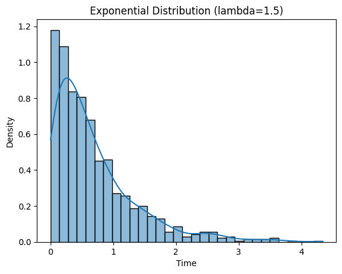

# Exponential Distribution

- It is widely used to model the time or space between events in a poisson process.
- It describes how long you have to wait before something happens.

*(For example if a bus arrives at bus stops every 15 min on average then the time you have to wait for the next bus can be modeled using an exponential distribution)*

## Probabilty Density Function

$$
f(x;\lambda) = \lambda e^{-\lambda x}, x \leq 0
$$

- $\lambda > 0$ is the rate parameter *(how often events occur)* 
- x is the time or distance until next event.

## Cumulative Density Function
- It gives the probability that the events occurs within time

$$
F(x;\lambda) = 1 - e^{-\lambda x}, x \geq 0
$$

## Mean 
Expected value is $\mathbb{E}[X] = \frac{1}{\lambda}$

## Variance 
$Var(X) = \frac{1}{\lambda^2}$

## Memoryless Property
- This tells us that waiting longer does not depend on how long you've already waited.
- `This is unique to exponential distribution`

## Question
Suppose calls come into a customer support center at an average rate of 2 per minute. What is the probability that you wait more than 30 seconds for the next call?

#### Solution

1. Understand the Rate (λ): Since 2 calls come in per minute, that means the average rate is: λ=2 calls per minute
2. Convert Time: Find the probability of waiting more than 30 seconds. But since the rate is in minutes, convert 30 seconds to minutes: 30 seconds=0.5 minutes
3. Use the Exponential Distribution formula:

$$
P(X > 0.5) = e^{-\lambda x} = e^{- 2 \times 0.5} = e^{-1} ≈0.3679
$$

So, there is about a 36.79% chance that the next call comes after 30 seconds.

## Python Implementation

```python
import numpy as np
import matplotlib.pyplot as plt
import seaborn as sns

# Set the rate parameter lambda
lam = 1.5

# Generate exponential data
data = np.random.exponential(1/lam, 1000)

# Plot the KDE and histogram
sns.histplot(data, kde=True, stat="density")
plt.title("Exponential Distribution (lambda=1.5)")
plt.xlabel("Time")
plt.ylabel("Density")
plt.show()
```



## Applications
- **Call Centers** : Time between incoming calls
- **Bank Queues** : Time between customer arrivals
- **Web Servers** : Time between requests
- **Manufacturing**: Time until a machine part fails
- **Transport**: Time between buses or trains