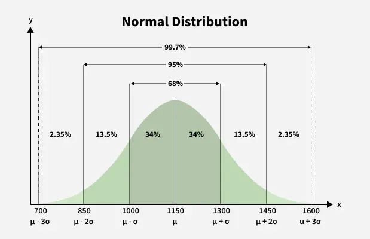
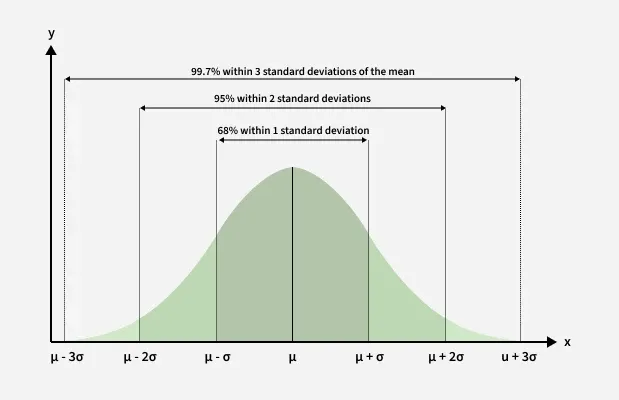
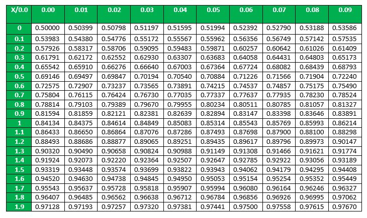
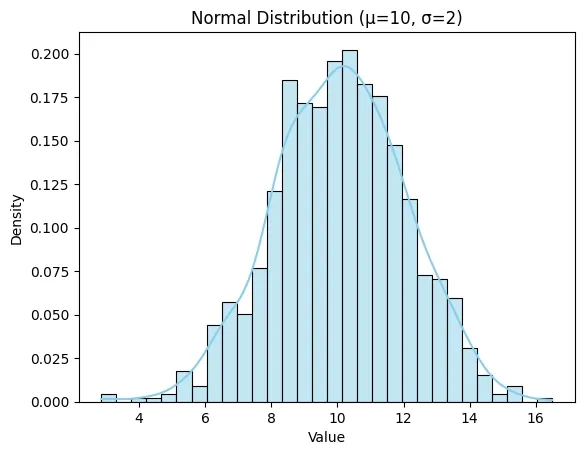

# Normal Distribution

- It is the also called Gaussian Distribution or Bell Shaped Distribution.
- It plays an important role in probability such as in Central Limit theorem.
- It is symmetric around the mean $(\mu)$ 
- Symmetry shows that all values are equally distant from mean value.
- `Probability of an event decreases as we move away from mean` as most events cluster around the center.



## Probability Density Function (PDF)
It is the likelihood of a random variable taking a particular value.

$$
f_X(x) = \frac{1}{\sigma \sqrt{2\pi}} \, e^{ -\frac{1}{2} \left( \frac{x - \mu}{\sigma} \right)^2 }
$$

- $\mu$ (mu) is the mean of the distribution, It is the central value of the distribution.
- $\sigma$ (sigma) is the standard deviation which measures the spread or dispersion of the disribution.
- $x$ is the specific value for which we are calculating probability.
- $\frac{x - \mu}{\sigma}$ is called Z-score and shows how many standard deviations a data point is from mean.
- `Larger Z score results in smaller probabilites and value closer to mean causes small Z score and high probabilities`.



## Expectation
- It gives a random of the "center" of the distribution. 
- For a normally distributed random variable X with parameters $\mu$ (mean) and $\sigma^2$ (variance) expectation is calculated by integrating the product of the random variable and it's PDF over all possible values.

$$
\mathbb{E}[X] = \int_{-\infty}^{\infty} x \, f_X(x) \, dx
$$

for the normal distrbution, the formula becomes: 

$$
\mathbb{E}[X] = \frac{1}{\sigma \sqrt{2 \pi}} xe^{- \frac{1}{2}(\frac {x-\mu}{\sigma})} dx
$$

1. Integrating $(x - \mu)$ which is symmetric about the mean and it's result is zero because the distribution is symmetric.
2. Multiplying the mean $(\mu)$ by the total probability which equals 1. (since area under normal curve is always 1)

We have $\mathbb{E} = \mu$

## Standard Normal Distribution
Mean $\mu$ is set to 0 and Standard Deviation $\sigma$ is set to 1

$$
f_X(x) = \frac{1}{\sqrt{2\pi}} e^{-\frac{x^2}{2}}
$$

## Cumulative Distribuition Function
- It does not have a closed form expression. 
- Precomputed values from normal tables are used to find cumulative probabilities.
- We start with standarise values by converting them into z-score than probability can be obtained.



## Question
Suppose that the current measurements in a strip of wire are assumed to follow a normal distribution with a mean of 10 milliamperes and a variance of four $milliamperes^2$. What is the probability that a measurement exceeds 13 milliamperes?

### Solution

1. Let X denote the current in milliamperes. We are tasked with finding P (X > 13).

2. Standardize X by converting it to a z-score:

$$
Z= \frac{X−\mu}{\sigma}​ = \frac{13 - 10}{\sqrt{4}} = \frac{3}{2} = 1.5
$$

3. Now P(X > 13) becomes equivalent to P(Z > 1.5) in the standard normal distribution.

4. From the standard normal table, find the value of 
$P(Z\leq1.5)$ =0.93319 

5. So $P(Z\geq1.5)=1−P(Z\leq5) =1−0.93319=0.06681$ 

Thus the probability that the current exceeds 13 milliamperes is approximately 0.06681, or 6.7%.

## Using Numpy
```python
import numpy as np
import matplotlib.pyplot as plt
import seaborn as sns

mean = 10          
std_dev = 2       
size = 1000       

data = np.random.normal(loc=mean, scale=std_dev, size=size)

sns.histplot(data, kde=True, stat="density", bins=30, color="skyblue", linewidth=0.8)

plt.title(f'Normal Distribution (μ={mean}, σ={std_dev})')
plt.xlabel('Value')
plt.ylabel('Density')
plt.show()
```



## Applications
1. Scientific Research *(helps in measuring experimental design and hypothesis testing)*
2. Finance *(Analyse stock prices for risk assesment and portfolio optimisation)*
3. Healthcare *(Certain biological measurements tend to follow normal distribution which helps us identify outliers)*