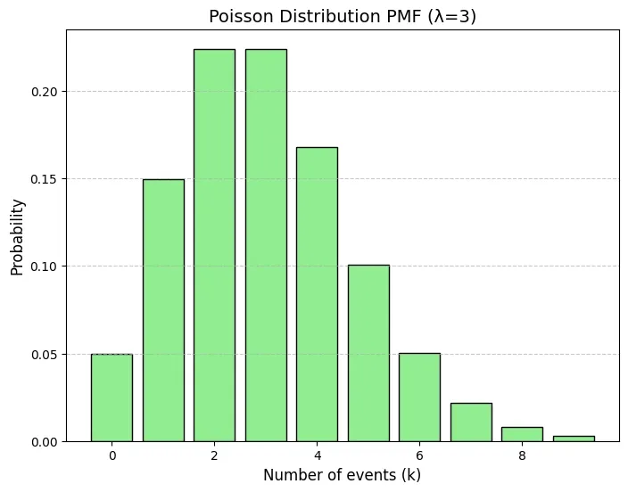
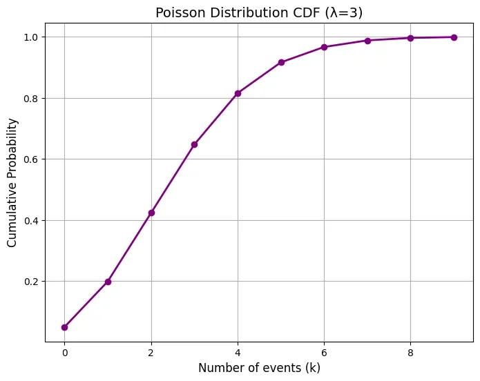

# Poisson Distribution

- It is a discrete distribution that models the number of events occuring in a fixed interval or space or time given a constant average rate of occurance.
- Unlike Binomial Distributions that occurs for a fixed number, Poisson Distributions occurs randomly over time and space.
- It is suitable for modeling rare events.
- Denoted by $\lambda$

## Important terms

### Events 
- It models events within a given time frame or spatial area.
- Events must occur independently.
- Events should occur at a constant rate over the interval.

### Average rate
- Known as rate parameter denoted by $\lambda$
- It represents number of occurances of an event in given time period or spatial area.
- It is central to the poisson distribution and shape the distribution

### Time or Space Interval
- It is the interval where we observe the occurences of events important to us.

### Formula

$$
P(X = x) = \frac{e^{-\lambda} \lambda^x}{x!}
$$

- $P(X=x)$ -  probability of observing exactly x events in the interval.
- ${\lambda}$ - average rate of occurnences in interval.
- ${x}$ - It is the euler number of events for which we are calculating the probability.
- $e$ is the Euler's number which is approx 2.718

## Probability Mass Function
- It is used to calculate probability of exactly x events occuring in a fixed interval.

### Question
Let’s us consider a call center which receives on average 3 calls per hour (λ = 3) and we want to know the probability of receiving exactly 4 calls in one hour (x=4).

### Answer

$$
P(X=4) = \frac{e^{-3} 3^4}{4!} = \frac{e^{-3} 81}{24} ≈0.168
$$

## Cumulative Distribution Function
- It gives the probability of observing at most x events within a fixed interval
- It is a sum of probabilities from P(X = 0) to P(X = x)

$$
F(x) = P(X \geq x) = \sum^x_{k=0} P(X = k)
$$

### Example
If we want to know the probability of receiving 3 or fewer calls in one hour we would calculate the CDF as:

$P(X≤3)=P(X=0)+P(X=1)+P(X=2)+P(X=3)$

This sum gives us the probability of receiving 0, 1, 2 or 3 calls in an hour which is helpful in scenarios where the exact number of events is not important but the total number of events up to a certain point is.

## Expected Value 
- It is the average number of events we expect to occur within a given sapce or time interval
- It is simply mean value

$$
\mathbb{E}[X] = \lambda
$$

## Variance
- It tells us how much the actual number of events deviates from the expected number of events.
- It is also equal to average rate of events

$$
Var[X] = \lambda
$$

## Standard Deviation
- It is the square root of the variance.

$$
\sigma = \sqrt{\lambda}
$$

## Example 
Let’s apply the Poisson Distribution in a real-life scenario. Suppose that traffic accidents occur on a certain road at an average rate of 2 accidents per month (λ=2). We can use the Poisson Distribution to calculate the probability of having exactly 3 accidents in a given month. Using the Poisson PMF formula, we get:

$P(X=3)= \frac{e^{-2} \cdot 2^3}{3!} ≈ 0.180$

Thus the probability of having exactly 3 accidents in one month is 0.180 or 18%.

## Python Implementation
```python
import matplotlib.pyplot as plt
import numpy as np
from scipy.stats import poisson

lambda_val = 3  
k = np.arange(0, 10)  
pmf = poisson.pmf(k, lambda_val)

plt.figure(figsize=(8, 6))
plt.bar(k, pmf, color='lightgreen', edgecolor='black')
plt.title('Poisson Distribution PMF (λ=3)', fontsize=14)
plt.xlabel('Number of events (k)', fontsize=12)
plt.ylabel('Probability', fontsize=12)
plt.grid(axis='y', linestyle='--', alpha=0.7)
plt.show()

cdf = poisson.cdf(k, lambda_val)

plt.figure(figsize=(8, 6))
plt.plot(k, cdf, color='purple', marker='o', linestyle='-', linewidth=2)
plt.title('Poisson Distribution CDF (λ=3)', fontsize=14)
plt.xlabel('Number of events (k)', fontsize=12)
plt.ylabel('Cumulative Probability', fontsize=12)
plt.grid(True)
plt.show()

probability_4_events = poisson.pmf(4, lambda_val)
print(f'Probability of exactly 4 events: {probability_4_events:.4f}')
```





## Poisson vs Exponential
- **Poisson Distribution**: Models the number of events occurring in a fixed interval of time or space.

$$
P(X = k) = \frac{e^{-\lambda}}{k!}, k = 0,1,2,3, ...
$$

- **Exponential Distribution**: Models the time between consecutive events in the same poisson process.

$$
f(x) = \lambda e^{-\lambda x}, x \geq 0
$$

Both distributions are defined by the same rate parameter λ which represents the average number of events per unit of time or space.

## Applications 
- **Traffic and Accident Analysis** : Used to model the number of accidents occurring at an intersection over a fixed period.
- **Telecommunications** : Models the number of calls received by a call center or the number of network requests in a given time period.
- **Medical Field**: In healthcare it models rare events like the number of new cases of a disease in a given time period.
- **Queuing Theory**: Applied to understand the number of customers arriving at a service point (e.g bank or checkout line) within a certain time period.