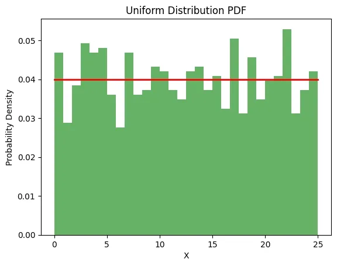

# Uniform Distribution

- It is also called `Rectangular Distribution` 
- It is a type of continious probability distribution where all outcomes in a given interval are equally likely.
- They have a constant probability density throughtout interval that causes `flat` distribution.

## Important Terms

### Events and Interval
- Uniform distribution applies to events that are equally likey within a fixed interval.
- Interval can represent time, space or any continous measurment.
- The events are random and independent but they all have the same likelihood of occuring.

*(If a fair die is rolled each side (1 to 6) is equally likely to appear which represents a discrete uniform distribution. In contrast, a continuous uniform distribution could model the outcome of a randomly chosen time within a 24-hour day where every moment has the same probability.)*

## Probability Density Function
- It is constant across entire interval [a,b] as every point is likely to be chosen.

$$
f(x) = \frac{1}{b-a} , a\leq x \leq b
$$

- For any x outside the interval [a,b] the PDF = 0 $f(x) = 0, \;\text{for} \; x<a \;\text{or} \; x>b$

## Cumulative Distribution Function
- It provides the probability that random variable is less tan or equal to secific value x.
- It is the sum of PDF over the range from a to x.

$$
F_X(x) = 
\begin{cases}
0 & \text{if } x < a \\
\frac{x - a}{b - a} & \text{if } a \leq x \leq b \\
1 & \text{if } x > b
\end{cases}
$$

## Expected Value
- It is the central tendency of the distribution. It is the average of lower and upper bounds of the interval.

$$
\mathbb{E}[X] = \frac{a+b}{2}
$$

Example: For a Uniform Distribution with a=0 and b=25, the expected value is:

$\mathbb{E}[X]=\frac{0+25​}{2}=12.5$ 

This means the average value of the random variable X is 12.5.

## Variance 
- It is the spread of values around the mean and it's formula

$$
Var(X) = \frac{{b-a}^2}{12}
$$

- For a=0 and b=25, the variance is: $Var(X)= \frac{(25−0)^2}{12} = \frac{625}{12}≈52.08$

This tells us how much the values are expected to deviate from the mean.

## Standard Deviation
- It is the square root of the variance and provides a measure of the dispersion of the distribution.

$$
\sigma = \sqrt{Var(X)} = \frac{b-a}{\sqrt{12}}
$$

Example: For a=0 and b=25: $\sigma = \frac{25-0}{\sqrt{12}}≈7.21$

## Numpy Works
```python
import numpy as np
import matplotlib.pyplot as plt
a = 0  
b = 25  
samples = np.random.uniform(a, b, 1000)

plt.hist(samples, bins=30, density=True, alpha=0.6, color='g')

x = np.linspace(a, b, 1000)
plt.plot(x, np.ones_like(x) / (b - a), 'r-', lw=2)

plt.title('Uniform Distribution PDF')
plt.xlabel('X')
plt.ylabel('Probability Density')
plt.show()
```



## Applications 
1. Random Sampling. *(In simulations it helps making random choices)* 
2. Quality Control. *(It helps in making product measurements so no bias in present in manufacturing)*
3. Lottery and Gaming. *(It helps making random selection of random number or cards)*